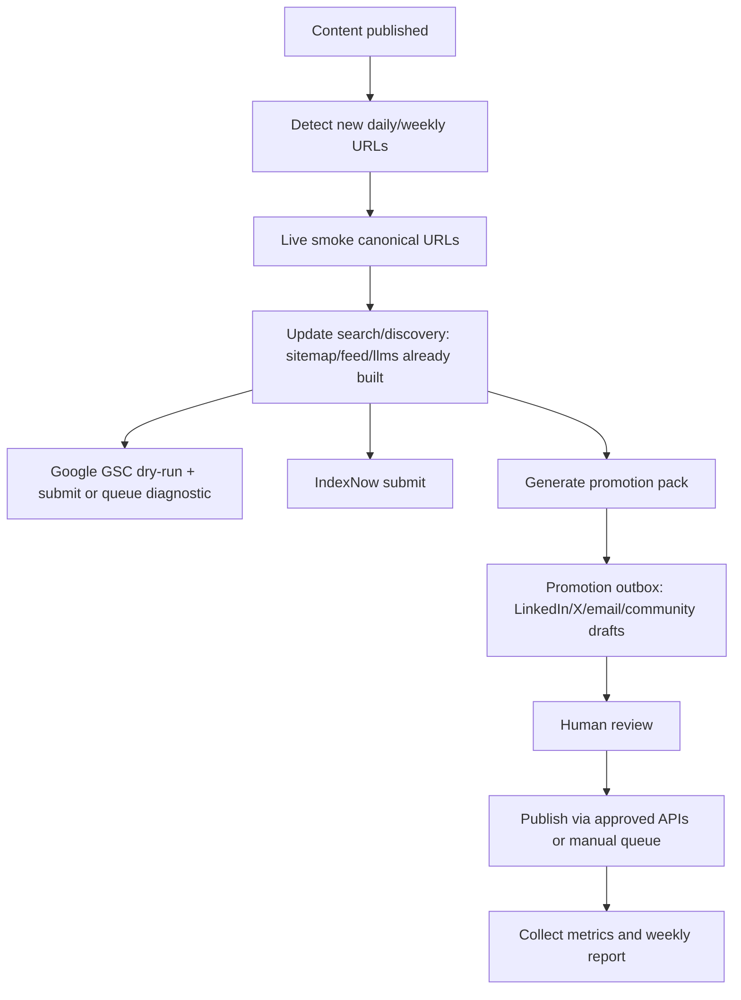

# VentureDex traffic growth and promotion automation plan

Date: 2026-06-12 CST
Scope: VentureDex public site, daily startup profiles, weekly research issues, newsletter, search/discovery surfaces, and automation after content publication.

## Executive summary

VentureDex already has a stronger technical SEO foundation than a typical early content site: canonical URLs, sitemap, RSS, JSON-LD, article metadata, large screenshot OG images on startup details, `llms.txt`, Cloudflare Web Analytics, newsletter infrastructure, and a daily/weekly publishing process.

The growth gap is not "add SEO tags." The gap is the post-publish distribution loop:

1. New pages must reliably enter search/discovery systems.
2. Each new page must become a reusable distribution asset.
3. Weekly issues and collections must aggregate the daily pages into search-intent pages.
4. Owned audience growth must be measured through newsletter and repeat visits.
5. Community/social promotion must be queued and reviewed, not blindly spammed.

Highest-priority fixes:

1. Repair the Search Console request-indexing blocker for the latest daily pages.
2. Add IndexNow submission for Bing and participating search engines.
3. Generate a promotion pack after every daily/weekly publish.
4. Upgrade collections from thin category lists into editorial landing pages.
5. Build a weekly reporting loop from Search Console, Cloudflare Web Analytics, newsletter D1 state, and promotion outbox status.

## Current VentureDex audit

### Live discovery surfaces

Verified on 2026-06-12 CST:

| Surface | Current state | Growth meaning |
| --- | --- | --- |
| `https://venturedex.co/sitemap.xml` | HTTP 200, 250 URLs | Good inventory surface. Keep `lastmod` accurate and submit sitemap in GSC/Bing. |
| `https://venturedex.co/feed.xml` | HTTP 200, 30 items, latest build date 2026-06-11 06:04:13 UTC | Useful for RSS readers, Google Discover Follow, newsletter/source syndication. |
| `https://venturedex.co/llms.txt` | HTTP 200, 188 lines | Good AI-readable navigation file, but Google says AI Search does not require a special AI file. Treat this as helpful discovery, not a ranking lever. |
| `https://venturedex.co/robots.txt` | HTTP 200, search allowed, `/api/` disallowed; Cloudflare Managed Content-Signal prepended | Search crawling is open. The Cloudflare-managed prefix remains a control-plane item if AI/discovery policy needs tuning. |
| Startup detail pages | Article metadata, canonical URL, 1440x900 screenshot OG image, JSON-LD graph, source trail, internal related links | Strong share/search basis. Distribution should reuse these fields automatically. |
| Weekly issue pages | Article metadata and structured weekly JSON-LD | Good for research intent, but weekly OG assets are generic today. |
| Collection pages | Crawlable but mostly thin list pages | Biggest programmatic SEO opportunity if enriched with editorial summaries and latest evidence. |

### Content inventory

Local content inventory on 2026-06-12:

- 129 startup JSON files.
- 3 published weekly issues.
- Latest weekly issue: #3, `AI Is Moving Into the Awkward Work`, published 2026-06-08.
- Latest live RSS entries include 2026-06-11 startup profiles.
- Top content clusters by raw tags/types:
  - SaaS: 33
  - AI / ML: 30
  - DevTools: 22
  - Fintech: 16
  - HealthTech: 10
  - `ai agents`: 37 tagged profiles
  - `developer tools`: 16 tagged profiles
  - `ai infrastructure`: 9 tagged profiles

### Current blockers and risks

1. Search Console latest daily submission is blocked.

   `.gsc_submission_history.tsv` shows the 2026-06-11 daily URLs were dry-run, but live submit is stuck at `retry_pending` for at least:

   - `https://venturedex.co/startups/billables-ai`
   - `https://venturedex.co/startups/capsa-ai`

   `docs/automation/venturedex-learning-log.md` confirms the latest daily run shipped and live-smoked, but GSC request-indexing confirmation did not complete for the latest five pages.

2. Public Google results still show historical snippets and old `.html` URLs for some pages.

   Live `.html` URLs redirect to canonical URLs, but currently return `307` for examples such as `/weekly/1.html -> /weekly/1`. That works, but permanent `301` behavior is stronger for long-term canonical consolidation.

3. Collection pages are underused.

   Existing collections have a useful taxonomy, but the detail pages are mostly title, description, and cards. They should become "best startup directories by theme" pages with explanatory copy, latest additions, weekly issue links, and internal navigation.

4. Newsletter is production-ready but not yet a growth loop by itself.

   It has delayed send, D1 state, queues, and one-click unsubscribe, but promotion analysis should track subscriber acquisition source, confirmed subscriber rate, click UTMs, and post-send traffic.

5. Blind social/community automation would be harmful.

   Hacker News and Reddit both explicitly discourage spammy/self-promotional use. The right automation is draft/queue/measure, with human review and community-specific posting.

## External platform rules that shape the strategy

### Google Search and AI Search

- Google says AI Overviews / AI Mode use the same foundational SEO best practices; there are no extra technical requirements or special schema needed for AI features. Pages must be indexed and eligible for snippets.
- Google says it does not accept payment to crawl/index/rank faster and does not guarantee crawling or indexing.
- For individual URLs, Google recommends the URL Inspection tool, but notes there is a quota and repeated requests do not make the same URL crawl faster.
- Google deprecated the unauthenticated sitemap ping endpoint. Use sitemap discovery through robots.txt/Search Console and accurate `lastmod`, not `https://www.google.com/ping`.
- For Discover, Google recommends timely, useful content with compelling titles and large high-quality images at least 1200px wide. VentureDex startup screenshots satisfy the size requirement.
- Google Search Profiles launched in the US on 2026-06-04 for eligible publishers/creators with significant social/video following. This is not an immediate technical dependency, but VentureDex should prepare official social profiles and consistent site identity for future eligibility.

### Bing and IndexNow

Bing recommends IndexNow for real-time notification when URLs are added, updated, or deleted. This fits VentureDex's daily/weekly publish flow and should be automated after deploy/live smoke.

### Social and community channels

- LinkedIn's current Posts API supports organic text, images, videos, documents, article posts, and multi-image posts, but API access/permissions are approval-bound. Use it for owned-account posting only after auth is approved.
- Hacker News guidance allows occasional self-submission but says HN should not be used primarily for promotion.
- Reddit requires authentic community participation and forbids spam/content manipulation. Automate monitoring and draft suggestions, not posting.
- Product Hunt is relevant only for VentureDex itself or for major product launches, not every startup profile. It allows scheduling up to one month ahead and emphasizes authentic engagement and a maker first comment.

### Email deliverability

- Gmail requires SPF or DKIM for all senders; bulk senders need SPF, DKIM, and DMARC.
- Yahoo requires one-click unsubscribe support for marketing/subscribed mail, visible unsubscribe, honoring unsubscribes within two days, and keeping complaint rates below 0.3%.
- VentureDex already has list-unsubscribe / one-click unsubscribe architecture in `docs/newsletter.md`; growth automation must preserve that boundary.

## Target audiences and intent map

VentureDex should not optimize for generic "startup" traffic. It should own specific discovery intents:

| Audience | Search/social intent | Best VentureDex surface |
| --- | --- | --- |
| Investors | "AI agent startups", "Series A legal AI startup", "new developer tool startups" | Collections, weekly issues, investor pages |
| Founders/operators | "startup examples in [category]", "new AI workflow tools" | Startup detail pages, weekly research |
| Builders/product people | "best devtools startups", "MCP startup directory", "agent infrastructure companies" | Enriched collections, search page, weekly |
| Talent/BD readers | "startup hiring/careers links", "companies backed by [investor]" | Startup detail pages, investor pages |
| AI/search answer engines | entity-rich summaries with source trails | `llms.txt`, detail pages, JSON-LD, sitemap |

## Channel strategy

### 1. Search: make new URLs discoverable, then build topic authority

Keep:

- Canonical no-trailing-slash URLs.
- Sitemap with accurate `lastmod`.
- RSS in `<head>`.
- Startup detail JSON-LD and visible source trail.
- Large screenshot OG images.

Add:

- IndexNow submission after every successful deploy.
- GSC submit diagnostics that preserve screenshots/text artifacts when confirmation fails.
- Permanent redirect policy for old `.html` URLs if feasible.
- Search Console coverage report for latest 30 startup URLs and weekly URLs.
- Richer collection pages around the strongest clusters:
  - AI agents startups
  - AI infrastructure startups
  - Developer tools startups
  - Legal AI startups
  - Fintech infrastructure startups
  - Healthcare AI startups
  - Physical AI and robotics startups
  - Open-source startup tools

Collection-page template should include:

- 150-250 word editorial intro.
- "Newest in this collection" section.
- "Why these companies matter now" section based on funding/product evidence.
- Links to related weekly issues.
- Top investors represented.
- RSS/search link for the tag.

### 2. Discover and RSS: make visual/story packaging consistent

VentureDex has large images on startup details, which is good for Discover eligibility. Next:

- Ensure every weekly issue has a unique 1200x630 or larger OG image, not only the site default.
- Keep titles specific and non-clickbait.
- Continue linking RSS in `<head>`.
- Add "Follow via RSS" copy on subscribe/about pages.
- Prepare for Google Search Profiles by aligning official website, avatar, bio, and social/video handles.

### 3. Owned audience: newsletter as the compounding asset

Newsletter should be promoted as "source-backed startup research", not as generic updates.

Improvements:

- Add source tracking to subscription forms: `?source=footer`, `?source=weekly`, `?source=profile`, `?source=linkedin`, etc.
- Add a compact subscribe CTA to startup detail pages after "Source trail" or before "Related startups".
- Add a stronger weekly subscribe CTA to `/weekly` and `/weekly/{issue}`.
- Track clicked links with UTMs, not invasive tracking pixels.
- Weekly report should include subscriber count, confirmed count, sends, delivery failures, and top clicked UTMed URLs if available.

### 4. Social: automate assets, keep publishing reviewed

For every daily batch, generate:

- One LinkedIn post summarizing 3-5 new profiles.
- One X/Threads short post per strongest profile.
- One "weekly research" post when a weekly issue publishes.
- One image/card asset using existing screenshot + title.
- UTM links per channel.

Suggested daily LinkedIn format:

```text
New on VentureDex: 5 source-backed startup profiles from this week's funding signals.

- Billables AI: legal timekeeping AI
- Capsa AI: private-capital deal workflow
- Jedify: context graph for enterprise AI
- Poetic: enterprise process automation
- Fearn: patent drafting workflow

Each profile includes product evidence, funding source, risks, and official links.

{weekly_or_latest_url}?utm_source=linkedin&utm_medium=social&utm_campaign=daily_YYYY_MM_DD
```

Do not auto-post to Reddit/HN. Instead:

- Detect if a profile has a truly HN-relevant angle: open source, devtools, technical essay, benchmark, or strong original research.
- Draft a submission title using original/source wording.
- Queue it for human review.
- Avoid repeating VentureDex links in communities where the original source is more appropriate.

### 5. Backlinks and relationship loops

Every accepted startup gives VentureDex a natural outreach target. Automate a polite reviewed outbox item:

- To company/founder: "We published a source-backed VentureDex profile. If any official link is wrong, reply with the canonical correction."
- To investor: "Your portfolio company is included; here is the profile and source trail."
- To newsletter/social: "Featured on VentureDex" share copy.

Do not ask for backlinks directly. Make it easy to share:

- Provide a clean profile URL.
- Provide one short pull quote from the editor note.
- Provide a screenshot card.
- Provide "source correction" path to build trust.

## Automation architecture

### Post-publish promotion pipeline

Trigger: after local gates, deploy, live smoke, and D1/site parity pass.



### Proposed files and scripts

Add these incrementally:

| File | Purpose |
| --- | --- |
| `scripts/promotion/collect-latest.ts` | Read `content/timestamps.json` and `content/weekly/*.json`; output latest URLs and metadata. |
| `scripts/promotion/indexnow.ts` | Submit changed URLs to IndexNow after deploy. |
| `scripts/promotion/build-pack.ts` | Generate social/email/outreach drafts with UTM links. |
| `docs/promotion/outbox/YYYY-MM-DD.md` | Human-readable promotion queue for the latest publish. |
| `docs/promotion/metrics/YYYY-MM-DD.md` | Weekly performance report. |
| `d1/schema.sql` optional extension | `promotion_events` table for channel, URL, UTM, status, posted_at, result_url. |
| `scripts/promotion/gsc-health.ts` | Parse `.gsc_submission_history.tsv` and fail/report when latest URLs lack `requested`. |

### Promotion pack schema

```json
{
  "run_date": "2026-06-12",
  "campaign": "daily_2026_06_11",
  "urls": [
    {
      "type": "startup",
      "slug": "billables-ai",
      "title": "Billables AI SaaS Startup Profile",
      "url": "https://venturedex.co/startups/billables-ai",
      "summary": "AI timekeeping and task-intelligence platform for law firms.",
      "why_featured": "Legal timekeeping AI",
      "funding": "$10M Series A",
      "og_image": "https://venturedex.co/screenshots/billables-ai.webp",
      "utm": {
        "linkedin": "https://venturedex.co/startups/billables-ai?utm_source=linkedin&utm_medium=social&utm_campaign=daily_2026_06_11&utm_content=billables_ai",
        "x": "https://venturedex.co/startups/billables-ai?utm_source=x&utm_medium=social&utm_campaign=daily_2026_06_11&utm_content=billables_ai"
      }
    }
  ],
  "drafts": {
    "linkedin": "...",
    "x": ["..."],
    "founder_outreach": ["..."],
    "investor_outreach": ["..."]
  }
}
```

### GSC guardrail

Current runbook says GSC dry-run + submit is required after deploy/live smoke. The latest run shows this is now the broken link. Add a guard:

- If latest URLs have only `dry_run` or `retry_pending`, mark promotion status `search_submission_blocked`.
- Preserve exact URLs.
- Capture Search Console UI text/screenshot artifact when request confirmation fails.
- Do not repeatedly retry all URLs blindly.

### IndexNow design

Implementation shape:

1. Generate or store an IndexNow key.
2. Serve the key at `https://venturedex.co/{key}.txt`.
3. After deploy/live smoke, POST latest URLs to `https://api.indexnow.org/indexnow` or Bing endpoint.
4. Log response and URLs in `docs/promotion/metrics/` or D1 `promotion_events`.

Do not replace Google Search Console with IndexNow. Treat IndexNow as the Bing/participating-engine fast path.

## Measurement plan

Weekly dashboard should report by page type:

| Metric | Source | Why it matters |
| --- | --- | --- |
| Indexed/latest URL status | GSC ledger + Search Console | Confirms new pages can enter Google. |
| Google impressions/clicks/CTR/position | Search Console | Measures search demand and snippet quality. |
| Bing crawl/index signals | Bing Webmaster / IndexNow response | Measures IndexNow effect. |
| Referrers and pageviews | Cloudflare Web Analytics | Shows non-search distribution and repeat readers. |
| Newsletter confirmed subscribers | D1 `newsletter_subscriptions` | Owned audience growth. |
| Newsletter sends/deliveries/failures | D1 `newsletter_sends`, `newsletter_deliveries` | Deliverability and content reach. |
| Promotion outbox status | Markdown/D1 | Ensures content was actually distributed. |
| UTM sessions/clicks | Cloudflare Analytics or link logs | Compares LinkedIn/X/newsletter/community performance. |

Core KPIs:

- 7-day indexed rate for newly published URLs.
- Search CTR by page type.
- Subscribe conversion rate from startup detail pages and weekly pages.
- Weekly newsletter confirmed subscriber growth.
- Social/community clicks per published profile.
- Backlinks/referrals from founders/investors.

## 30/60/90 day roadmap

### Days 0-7: Fix the publication-to-discovery loop

1. Fix GSC request-indexing diagnostics.
   - Add visible-state detection and screenshot/text artifact capture.
   - Add single-URL diagnostic mode.
   - Re-run only the five 2026-06-11 URLs until each is `requested` or has a durable blocker.

2. Add IndexNow.
   - Key file route.
   - Submit latest daily/weekly URLs after deploy.
   - Log status.

3. Add promotion pack generator.
   - Generate LinkedIn, X/Threads, founder email, investor email, and community-review drafts.
   - Store under `docs/promotion/outbox/`.
   - Include UTM URLs.

4. Add weekly growth report skeleton.
   - GSC ledger status.
   - Live sitemap/feed URL counts.
   - Newsletter D1 latest sends.
   - Outbox status.

### Days 8-30: Turn inventory into topic authority

1. Enrich collection detail pages.
   - Add editorial intro, latest additions, investor clusters, related weekly issues.
   - Prioritize `ai-agents`, `developer-tools`, `ai-infrastructure`, `fintech`, `healthtech`.

2. Add "Latest on VentureDex" landing page or improve `/weekly`.
   - Make weekly research the main repeat-reader product.
   - Add stronger subscribe CTA.

3. Create weekly OG images.
   - 1200x630+ image for each weekly issue.
   - Reuse theme/title/pick names.

4. Build founder/investor share kit.
   - Public copy block on profile pages or private generated outbox.
   - Correction path and official-source trust message.

### Days 31-60: Automate reviewed distribution

1. Add LinkedIn API publishing only if approved credentials exist.
   - Otherwise keep generated drafts.
   - Never block core publish on social API failure.

2. Add social scheduling state.
   - `queued`, `approved`, `posted`, `skipped`, `failed`.
   - Store posted URL when available.

3. Add community candidate detector.
   - HN only for devtools/open-source/deep technical content.
   - Reddit only with community-specific human review.

4. Add newsletter acquisition tracking.
   - Source field from forms.
   - UTM links in newsletter.
   - Weekly conversion report.

### Days 61-90: Compound authority

1. Publish quarterly VentureDex research pages.
   - "AI agent startups map"
   - "Developer tools funding signals"
   - "Enterprise AI workflow startups"

2. Add public data endpoints if useful.
   - Curated RSS by collection.
   - Lightweight JSON feed by tag/collection.
   - Keep API crawlable only if intended; otherwise keep `/api/` disallowed.

3. Prepare Google Search Profile eligibility.
   - Consistent official social profiles.
   - Bio/avatar/links.
   - Cross-post weekly research to official channels.

4. Build backlink/referral review.
   - Which companies/investors shared VentureDex.
   - Which source pages link back.
   - Which categories drive qualified traffic.

## Concrete next engineering tasks

Priority order:

1. `scripts/submit-gsc-direct.sh`: add diagnostic artifact capture and single-URL mode for request failures.
2. `scripts/promotion/indexnow.ts`: implement IndexNow key serving and URL submit.
3. `scripts/promotion/build-pack.ts`: generate reviewed outbox drafts for latest daily/weekly URLs.
4. `src/pages/collections/[slug].astro`: enrich collection pages with editorial sections and latest/weekly/investor context.
5. Weekly OG image generation: add per-issue social cards.
6. Subscribe CTA placement and source tracking.
7. Weekly growth report script.

## Source links

- Google AI features and your website: https://developers.google.com/search/docs/appearance/ai-features
- Google ask to recrawl URLs: https://developers.google.com/search/docs/crawling-indexing/ask-google-to-recrawl
- Google sitemap ping deprecation: https://developers.google.com/search/blog/2023/06/sitemaps-lastmod-ping
- Google Discover guidance: https://developers.google.com/search/docs/appearance/google-discover
- Google SEO starter guide: https://developers.google.com/search/docs/fundamentals/seo-starter-guide
- Google helpful content guidance: https://developers.google.com/search/docs/fundamentals/creating-helpful-content
- Google how Search works: https://developers.google.com/search/docs/fundamentals/how-search-works
- Bing IndexNow announcement: https://blogs.bing.com/webmaster/october-2021/IndexNow-Instantly-Index-your-web-content-in-Search-Engines
- Google Search Profiles announcement: https://blog.google/products-and-platforms/products/search/a-new-profile-to-help-publishers-and-creators-highlight-their-work-on-search/
- LinkedIn Posts API: https://learn.microsoft.com/en-us/linkedin/marketing/community-management/shares/posts-api
- Hacker News Guidelines: https://news.ycombinator.com/newsguidelines.html
- Reddit Rules: https://redditinc.com/policies/reddit-rules
- Product Hunt launch guide: https://www.producthunt.com/launch
- Gmail sender guidelines: https://support.google.com/mail/answer/81126
- Yahoo sender best practices: https://senders.yahooinc.com/best-practices/
