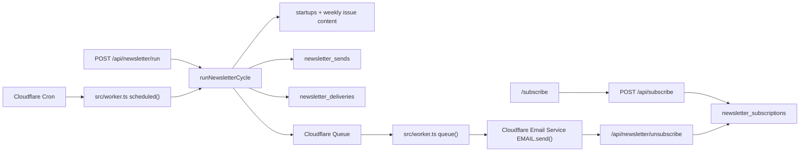

# VentureDex Newsletter System

## Goal

VentureDex newsletters are real delivery products, not a form capture. They send:

- Daily additions: new startup profiles that have already been published on the site and have passed a delay window.
- Weekly research: the published Weekly issue after an additional review buffer.

The email body reuses the same source material as the website: startup summaries, editor notes, funding signal, structured `research.product_evidence`, `research.market_context`, `research.risks`, and Weekly pick evaluations.

## Cloudflare Product Boundary

Newsletter delivery uses Cloudflare products only:

- Cloudflare Cron Triggers schedule the Daily and Weekly runs.
- Cloudflare D1 stores subscriptions, send state, and delivery state.
- Cloudflare Queues buffers one delivery message per subscriber and handles retry/backoff.
- Cloudflare Email Service sends outbound email through the Workers `EMAIL` binding.

Cloudflare Email Service is currently beta and requires the Workers Paid plan. It sends through the `env.EMAIL.send()` Workers binding, supports HTML, text, custom headers, and account suppression lists. The implementation does not call Resend, SMTP, MailChannels, or another outside sender.

## Architecture



Cron/Admin snapshots the rendered digest into `newsletter_sends`, creates delivery rows, and enqueues per-recipient delivery messages. Queue consumers render only recipient-specific wrapper data, especially unsubscribe links. This keeps retried recipients on the same editorial copy and avoids the Workers email binding limit of 50 combined recipients per email.

## Sending Cadence

The schedules live in `wrangler.toml`:

- Daily: `30 13 * * *` UTC, or 21:30 Asia/Shanghai.
- Weekly: `0 14 * * 2` UTC, or Tuesday 22:00 Asia/Shanghai.

Delay gates are separate from cron timing:

- `NEWSLETTER_DAILY_DELAY_HOURS=6`
- `NEWSLETTER_WEEKLY_DELAY_HOURS=24`
- `NEWSLETTER_WEEKLY_MAX_AGE_DAYS=21`

The first daily run records a baseline instead of sending historical content. This prevents a first deploy from emailing the entire existing catalog. Future daily runs send only profiles published after the last daily send and older than the delay cutoff.

## Configuration

Required Cloudflare resources:

```bash
npx wrangler queues create venturedex-newsletter-delivery
npx wrangler queues create venturedex-newsletter-delivery-dlq
```

Required Cloudflare Email Service setup:

- Onboard `venturedex.co` in Cloudflare Email Sending.
- Add the Cloudflare-generated SPF, DKIM, DMARC, and bounce-handling DNS records.
- Keep the Worker on a plan that supports Cloudflare Email Service sending.

Required production secrets:

- `NEWSLETTER_ADMIN_TOKEN`
- `NEWSLETTER_MAILING_ADDRESS`

Required production vars and bindings:

- `NEWSLETTER_FROM`, currently `VentureDex <newsletter@venturedex.co>`
- `SITE_URL=https://venturedex.co`
- `[[send_email]]` binding named `EMAIL`
- `[[queues.producers]]` binding named `NEWSLETTER_DELIVERY_QUEUE`
- `[[queues.consumers]]` for `venturedex-newsletter-delivery`

Optional vars:

- `NEWSLETTER_REPLY_TO`
- `NEWSLETTER_DAILY_DELAY_HOURS`
- `NEWSLETTER_WEEKLY_DELAY_HOURS`
- `NEWSLETTER_WEEKLY_MAX_AGE_DAYS`
- `NEWSLETTER_BOOTSTRAP_DAILY`

## Module Review

### Subscription Lifecycle

Files:

- `src/pages/subscribe.astro`
- `src/pages/api/subscribe.ts`
- `src/pages/unsubscribe.astro`
- `src/pages/api/newsletter/unsubscribe.ts`
- `d1/schema.sql`

Review:

- The subscribe page is server-rendered, so it avoids the static trailing-slash redirect problem.
- A subscriber can select Daily additions, Weekly research, or both.
- Re-submitting a previously unsubscribed address does not clear the opt-out from the public form and returns an explicit opted-out state instead of a false success. This prevents third parties from reversing an unsubscribe.
- The subscribe API rejects cross-origin browser POSTs when an `Origin` header is present and includes a honeypot field to discard basic bot submissions without writing to D1.
- Every email has a body link to `/unsubscribe` and Cloudflare-whitelisted `List-Unsubscribe` / `List-Unsubscribe-Post` headers. One-click unsubscribe POSTs are intercepted in `src/worker.ts` before Astro origin checks; the interceptor accepts the one-click signal in either the POST body (`List-Unsubscribe=One-Click`) or the compatibility header used by local smoke tests.

### Send State, Queueing, and Idempotency

Files:

- `newsletter_sends`
- `newsletter_deliveries`
- `src/lib/newsletter.ts`
- `src/worker.ts`
- `wrangler.toml`

Review:

- `send_key` is unique: daily keys include the period window; weekly keys include the issue number.
- `newsletter_deliveries` is unique by `(send_id, subscription_id)`, so a forced rerun does not duplicate already sent rows.
- Queue messages carry only `sendId`, `deliveryId`, `newsletterType`, and `sendKey`; the consumer rehydrates recipient state and the already-snapshotted send body from D1.
- Each Queue consumer atomically claims a queued delivery with a `claim:*` marker before calling `EMAIL.send()`, records Cloudflare `messageId`, and finalizes the send when no queued deliveries remain.
- Cloudflare transient errors such as rate limits and internal service failures are retried by Queue. Permanent errors such as sender/domain/content validation failures are recorded as failed delivery rows.
- Forced reruns resume unsent deliveries only. If no unsent rows remain, the send finalizes immediately instead of being stranded in `sending`.
- The configured DLQ is for unexpected uncaught Queue/runtime failures. Normal application-level failures are acknowledged after D1 records the failed delivery row, so operators should inspect D1 first.

### Content Selection

Files:

- `src/lib/newsletter.ts`
- `src/lib/weekly.ts`

Review:

- Daily sends query D1 `startups` by `published_at` and the delay cutoff.
- Weekly sends use published `content/weekly/*.json` issue content, then hydrates startup records from D1 when available.
- Email copy is derived from the same editorial fields displayed on site detail pages, including daily source labels and weekly evidence/risks.
- No private metrics or unsourced claims are introduced by the email renderer.

### Template and Reading Experience

File:

- `src/lib/newsletter.ts`

Review:

- Email CSS is inline for client compatibility.
- Visual language mirrors the site: `#FAFAF9` page background, white cards, `#E5E5E5` borders, `#2563EB` accent, Georgia/Fraunces-style headings, compact metadata, and restrained cards.
- Text fallback is generated for every email.
- The template is text-first and does not depend on images loading.
- The renderer validates Cloudflare limits before sending: 998-character subject, 5 MiB message size, 16 KB custom header payload, 2,048-byte header values, and the current header allowlist used by the template.

### Automation and Operations

Files:

- `src/worker.ts`
- `wrangler.toml`
- `src/pages/api/newsletter/run.ts`
- `scripts/manage.sh`

Review:

- Cloudflare Cron is the automatic sender.
- The admin endpoint supports manual dry runs and force runs behind `NEWSLETTER_ADMIN_TOKEN`.
- `scripts/manage.sh release` now runs newsletter tests/type checks, migrates existing remote newsletter tables before applying content seed data, and performs a Wrangler dry-run preflight for the Email and Queue bindings plus required production secrets before deploy.
- Production sends fail closed if the Cloudflare Email binding, Queue binding, `NEWSLETTER_FROM`, or `NEWSLETTER_MAILING_ADDRESS` is missing.

Useful production inspection queries:

```sql
SELECT send_key, newsletter_type, status, item_count, recipient_count, error_log, updated_at
FROM newsletter_sends
ORDER BY datetime(created_at) DESC
LIMIT 10;

SELECT status, COUNT(*) AS count
FROM newsletter_deliveries
WHERE send_id = ?
GROUP BY status;

SELECT d.email, d.error_message, d.updated_at
FROM newsletter_deliveries d
JOIN newsletter_sends s ON s.id = d.send_id
WHERE s.send_key = ? AND d.status = 'failed'
ORDER BY datetime(d.updated_at) DESC;
```

## Test Cases

Automated tests live in `tests/newsletter.test.ts` and run with:

```bash
npm run test:newsletter
```

Covered cases:

- Email normalization accepts valid mixed-case input and rejects malformed addresses.
- Preference parsing defaults safely and handles explicit opt-outs.
- Form submissions reject the explicit "no newsletter selected" state.
- Daily digest HTML/text includes site detail content, product evidence, source labels, profile links, unsubscribe link, and VentureDex visual styles.
- Cloudflare Email Service messages include one recipient, sender object, per-recipient unsubscribe headers, and pass local Cloudflare limit validation.
- Weekly digest HTML/text includes issue copy, themes, pick evaluation, evidence, risks, full issue link, and text fallback.

Manual verification cases:

1. `npm run db:migrate`
2. `npm run test:newsletter`
3. `npm run build`
4. `npx wrangler deploy --dry-run --outdir /tmp/venturedex-worker-dryrun`
5. Start `wrangler dev --local`, submit `/subscribe`, and verify the local D1 subscriber row.
6. Call `POST /api/newsletter/run?type=daily&dry_run=1` with `Authorization: Bearer $NEWSLETTER_ADMIN_TOKEN`.
7. Confirm `/subscribe` and `/unsubscribe?token=...` return real pages, not redirect shells.
8. Confirm one-click unsubscribe with `POST /api/newsletter/unsubscribe?token=...` and body `List-Unsubscribe=One-Click`.
9. Before production sending, onboard Email Sending in Cloudflare, create the two queues, set `NEWSLETTER_ADMIN_TOKEN` and `NEWSLETTER_MAILING_ADDRESS`, then deploy.
